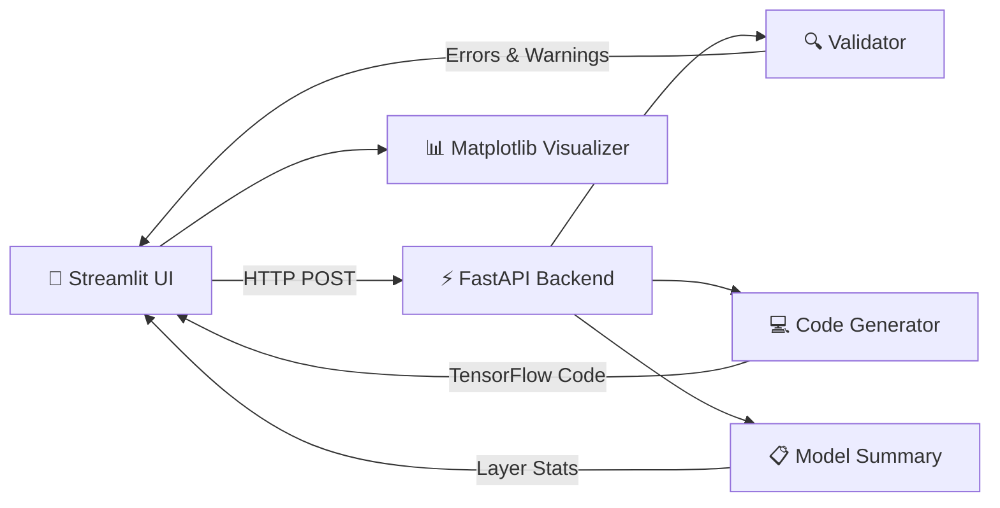

<p align="center">
  <h1 align="center">🧠 myNeuron</h1>
  <p align="center">
    <strong>Visual Neural Network Designer & Code Generator</strong>
  </p>
  <p align="center">
    Design neural networks visually. Export production-ready TensorFlow/Keras code.
  </p>
  <p align="center">
    <a href="#features">Features</a> •
    <a href="#demo">Demo</a> •
    <a href="#quick-start">Quick Start</a> •
    <a href="#architecture">Architecture</a> •
    <a href="#api-reference">API Reference</a> •
    <a href="#contributing">Contributing</a>
  </p>
</p>

---

## ✨ Features

<table>
  <tr>
    <td width="50%">
      <h3>🎨 Visual Layer Builder</h3>
      <p>Add and configure 25+ layer types through an intuitive sidebar UI. Supports Dense, Conv1D/2D/3D, LSTM, GRU, Bidirectional, Embedding, BatchNorm, Dropout, Pooling, and more.</p>
    </td>
    <td width="50%">
      <h3>📊 Real-Time Visualization</h3>
      <p>Publication-quality network diagrams rendered with Matplotlib — showing neurons, connections, layer shapes, and parameter counts at a glance.</p>
    </td>
  </tr>
  <tr>
    <td width="50%">
      <h3>💻 TensorFlow Code Generation</h3>
      <p>Export clean, runnable TensorFlow/Keras code using the Functional API. Includes compile and training configuration — ready to run on your machine or Google Colab.</p>
    </td>
    <td width="50%">
      <h3>🛡️ Architecture Validation</h3>
      <p>Catches shape mismatches, missing flatten layers, invalid configurations, and common mistakes before you even run the code.</p>
    </td>
  </tr>
  <tr>
    <td width="50%">
      <h3>📋 Model Summary</h3>
      <p>Layer-by-layer breakdown with output shapes, parameter counts, and total model statistics — just like <code>model.summary()</code>.</p>
    </td>
    <td width="50%">
      <h3>📦 Pre-Built Templates</h3>
      <p>Start from scratch or use pre-built templates for MLP, CNN, LSTM, and Autoencoder architectures to jumpstart your design.</p>
    </td>
  </tr>
</table>

---

## 🎬 Demo

🔗 **[Try it live → myneuron-4nl2tm0jjtq35afpohsxova.streamlit.app](https://myneuron-4nl2tm0jjtq35afpohsxova.streamlit.app)**

> **Design → Visualize → Export** in seconds.

1. **Select a layer type** from the sidebar (Dense, Conv2D, LSTM, etc.)
2. **Configure parameters** — units, activation, kernel size, dropout rate, etc.
3. **View the architecture** as a color-coded node diagram
4. **Generate TensorFlow/Keras code** with one click
5. **Validate** the architecture — get specific error messages for shape mismatches and missing layers

---

## 🚀 Quick Start

### Prerequisites

- **Python 3.10+**
- **pip** (Python package manager)

### Installation

```bash
# Clone the repository
git clone https://github.com/muddaBTW/myNeuron.git
cd myNeuron

# Create and activate virtual environment
python -m venv venv
venv\Scripts\activate          # Windows
# source venv/bin/activate     # macOS/Linux

# Install dependencies
pip install -r requirements.txt
```

### Running the App

You need two terminals — one for the backend, one for the frontend:

**Terminal 1 — Backend (FastAPI):**
```bash
cd backend
uvicorn main:app --reload --port 8000
```

**Terminal 2 — Frontend (Streamlit):**
```bash
cd frontend
streamlit run app.py
```

Open [http://localhost:8501](http://localhost:8501) in your browser and start building! 🎉

---

## ☁️ Deployment

The app is deployed as two services — both **free**:

| Service | Platform | URL |
|---------|----------|-----|
| **Backend API** | [Vercel](https://vercel.com) | [`my-neuron.vercel.app`](https://my-neuron.vercel.app/health) |
| **Frontend UI** | [Streamlit Cloud](https://share.streamlit.io) | [`myneuron.streamlit.app`](https://myneuron-4nl2tm0jjtq35afpohsxova.streamlit.app) |

### Deploy Backend to Vercel

1. Install the [Vercel CLI](https://vercel.com/docs/cli): `npm i -g vercel`
2. From the project root:
   ```bash
   vercel --prod
   ```
3. Note the deployed URL (e.g. `https://my-neuron.vercel.app`)

### Deploy Frontend to Streamlit Cloud

1. Go to [share.streamlit.io](https://share.streamlit.io) and sign in with GitHub
2. Click **"New app"** and select:
   - **Repository**: `muddaBTW/myNeuron`
   - **Branch**: `main`
   - **Main file path**: `frontend/app.py`
3. Under **Advanced settings → Secrets**, add:
   ```toml
   MYNEURON_API_URL = "https://your-vercel-app-url.vercel.app"
   ```
4. Click **Deploy**

---

## 🏗️ Architecture

```
myNeuron/
├── api/                        # Vercel Serverless
│   └── index.py                # Entry point (imports FastAPI app)
│
├── backend/                    # FastAPI REST API
│   ├── main.py                 # API endpoints & layer catalog
│   ├── models.py               # Pydantic data models & schemas
│   ├── code_generator.py       # TensorFlow/Keras code generation engine
│   └── validators.py           # Architecture validation & model summary
│
├── frontend/                   # Streamlit Web UI
│   ├── app.py                  # Main application (layout, state, tabs)
│   ├── visualizer.py           # Network diagram renderer (Matplotlib)
│   ├── layers_ui.py            # Layer configuration UI components
│   ├── requirements.txt        # Frontend-only dependencies
│   └── .streamlit/config.toml  # Theme & server config
│
├── vercel.json                 # Vercel routing & build config
├── test_api.py                 # API integration tests
├── requirements.txt            # Backend dependencies (Vercel uses this)
├── .gitignore
└── README.md
```

### How It Works



| Component        | Description |
|------------------|-------------|
| **Streamlit UI** | Dark-themed interface with sidebar layer builder, training config panel, and tabbed output (Visualization / Code / Summary) |
| **FastAPI API**   | REST API with endpoints for code generation, validation, and model summary |
| **Code Generator** | Converts layer configs into clean TensorFlow/Keras Python code (Sequential or Functional API) |
| **Validator**     | Static analysis of the architecture — detects shape mismatches, missing layers, and invalid parameters |
| **Visualizer**    | Renders the network as a node diagram with color-coded layers, connection lines, and parameter annotations |

---

## 📡 API Reference

| Endpoint | Method | Description |
|----------|--------|-------------|
| `/health` | `GET` | Health check |
| `/api/layer-catalog` | `GET` | Returns all available layer types with parameters |
| `/api/generate-code` | `POST` | Generates TensorFlow/Keras code from network config |
| `/api/validate` | `POST` | Validates the network architecture |
| `/api/model-summary` | `POST` | Returns per-layer summary with shapes & param counts |

### Example Request

```bash
curl -X POST http://localhost:8000/api/generate-code \
  -H "Content-Type: application/json" \
  -d '{
    "layers": [
      {"layer_type": "Input", "input_shape": [784]},
      {"layer_type": "Dense", "units": 256, "activation": "relu"},
      {"layer_type": "Dropout", "rate": 0.3},
      {"layer_type": "Dense", "units": 10, "activation": "softmax"}
    ],
    "compile_config": {
      "optimizer": {"optimizer_type": "adam", "learning_rate": 0.001},
      "loss": "sparse_categorical_crossentropy",
      "metrics": ["accuracy"]
    },
    "training_config": {"epochs": 10, "batch_size": 32, "validation_split": 0.2},
    "model_name": "MyMLP"
  }'
```

---

## 🧩 Supported Layers

| Category | Layers |
|----------|--------|
| **Core** | Input, Dense, Activation, Flatten, Reshape |
| **Convolutional** | Conv1D, Conv2D, Conv3D, SeparableConv2D |
| **Recurrent** | LSTM, GRU, Bidirectional, SimpleRNN |
| **Pooling** | MaxPooling1D/2D/3D, AveragePooling1D/2D/3D, GlobalAveragePooling1D/2D, GlobalMaxPooling1D/2D |
| **Normalization** | BatchNormalization, LayerNormalization |
| **Regularization** | Dropout |
| **Embedding** | Embedding |

---

## 🛠️ Tech Stack

| Layer | Technology |
|-------|-----------|
| **Frontend** | [Streamlit](https://streamlit.io/) |
| **Backend** | [FastAPI](https://fastapi.tiangolo.com/) |
| **Code Output** | TensorFlow / Keras (generated, not imported) |
| **Visualization** | [Matplotlib](https://matplotlib.org/) |
| **Validation** | [Pydantic](https://docs.pydantic.dev/) |
| **Language** | Python 3.10+ |

---

## 🧪 Testing

Run the API integration tests:

```bash
# Make sure the backend is running first
cd backend
uvicorn main:app --reload --port 8000

# In another terminal
python test_api.py
```

---

## 🤝 Contributing

Contributions are welcome! Here's how:

1. **Fork** the repository
2. **Create** a feature branch (`git checkout -b feature/amazing-feature`)
3. **Commit** your changes (`git commit -m 'Add amazing feature'`)
4. **Push** to the branch (`git push origin feature/amazing-feature`)
5. **Open** a Pull Request

---

## 📄 License

This project is open source and available under the MIT License.

---

<p align="center">
  Built with ❤️ by <a href="https://github.com/muddaBTW">muddaBTW</a>
</p>
